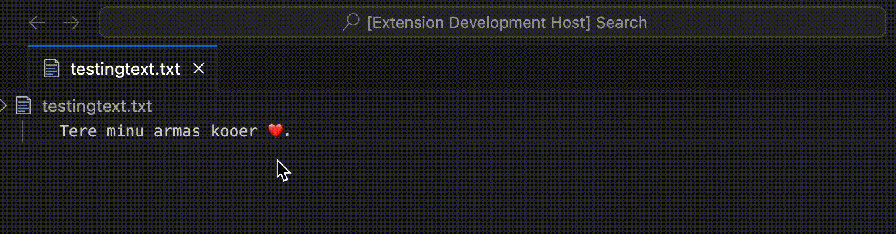

# krissugramma README

Command pallet: <kbd>💢</kbd> + <kbd>⬆️</kbd> + <kbd>🅿️</kbd> 

### Check whole document for Estonian gramma mistakes:
>krissugramma.checkGrammar

!! Can parse LaTex files and tryes to avoid command brackets

### Get suggestions for words
>krissugramma.getSuggestions

**Enjoy!**
